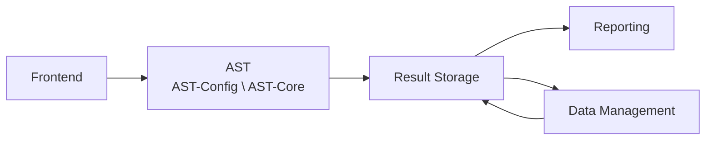

# automated-statusing-tool
Developing an open source implementation of the Automated Statusing Tool (AST) and Universal Overlap Tool (UOT)

**Under Development**

```mermaid
flowchart LR
    A[Frontend]
    B[AST </br> AST-Config \ AST-Core]
    C[Reporting]
    D[Result Storage]
    E[Data Management]
    A --> B --> D
    D --> C
    E --> D --> E
```

