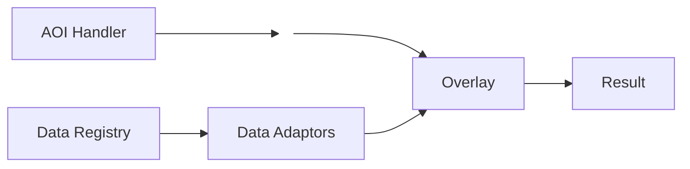

# AST
AST is a python application that provides normalized results of an overlay between an area of interest and prepopulated data regestry. AST-Config prepares data registry for the AST-core runtime. 

**Key Gaurdrails**
1. AOI is normalized once
2. Schema contracts are enforced
3. Inventory and registration is not perfomed at runtime
4. Environment driven configuration

**Key Technology**
- Python 3.13
- UV for manageing dependencies
- Geopandas

## AST-Config
- cron or trigger
- normalizes client config for AST-Core
- customizable to normalize multiple configurations
```
flowchart LR

    A["Client Provided<br/>Configuration"]
    B[Read]
    C[Validation]
    D[Enrichment]
    E[Data Registry </br> AST-Core]
    A --> B --> C
    C --> D --> E
```
## AST-core
- Operates at runtime  
- Provides data adapters
- Minimizes geometric overlay ops
- Use asyc for I/O operations when possible

