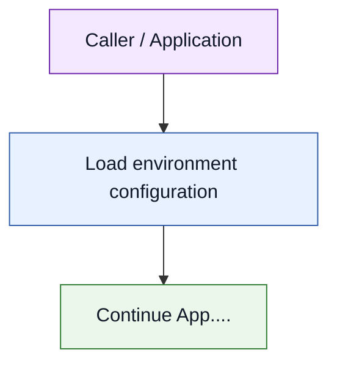
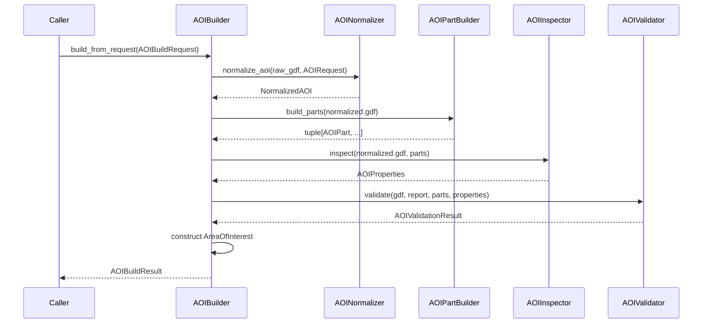
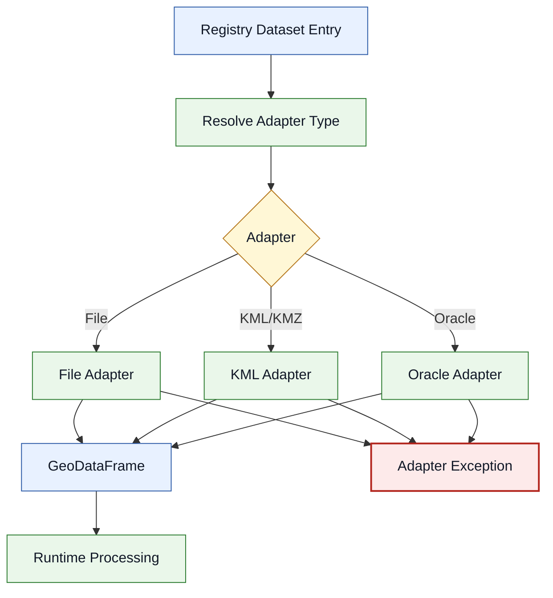
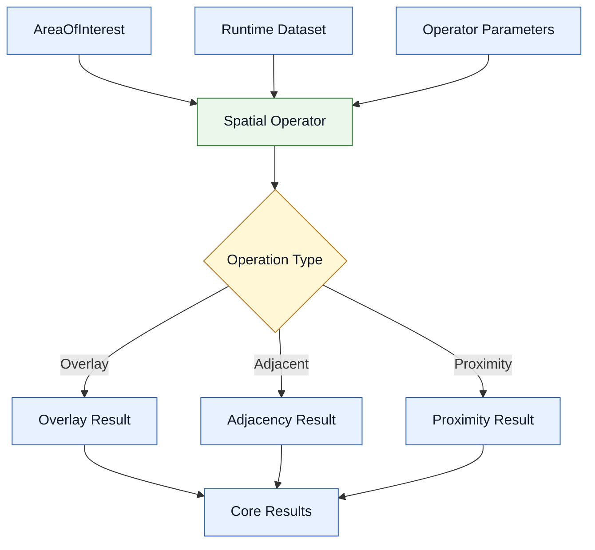
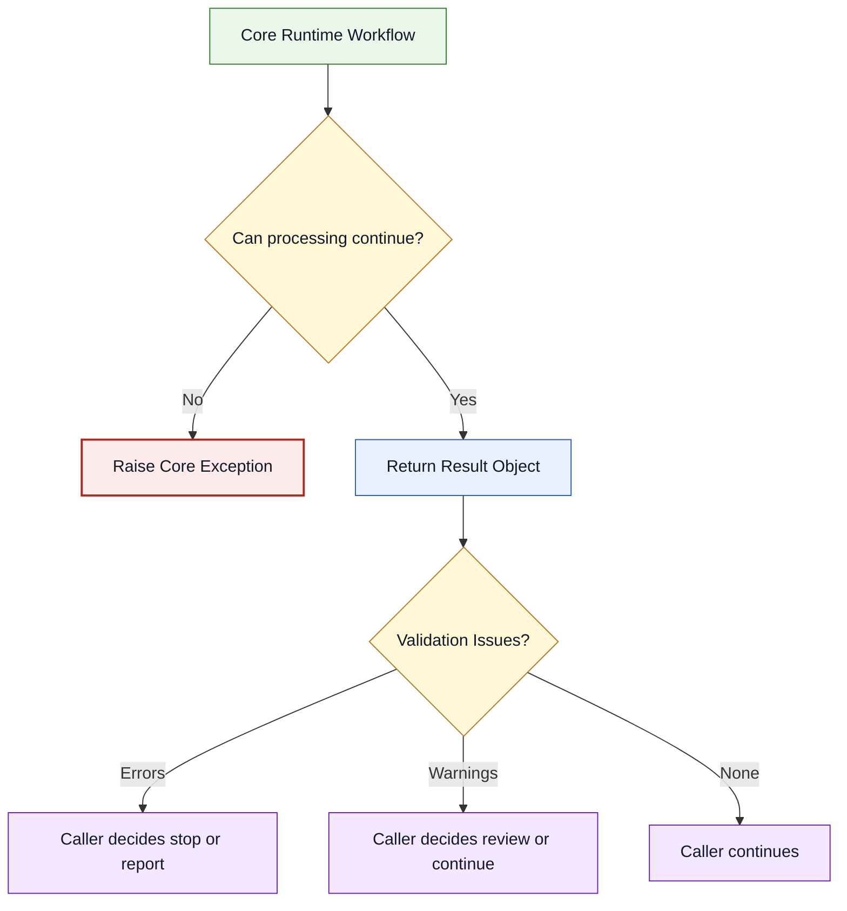

# Automated Status Tool Engine (`ast_engine`)

## Purpose

The **Automated Status Tool Engine** (`ast_engine`) is the Python package that provides the core configuration, validation, data inventory, and runtime processing components for the Automated Status Tool application.

At a high level, the engine produces normalized spatial results by processing an **Area of Interest (AOI)** against a pre-populated data registry.

The engine is split into two major responsibilities:

1. **AST-Config**
   Prepares, validates, and enriches configuration and data inventory inputs before runtime.

2. **AST-Core**
   Runs the runtime processing workflow using a normalized AOI and a pre-built data registry.

For full application-level context, deployment notes, and user-facing workflows, see the root README:

```text
../README.md
```

---

## Role in the Automated Status Tool Application

The `ast_engine` package is responsible for reusable processing logic. It is not intended to be a one-off script layer.

The application layer is responsible for:

* loading user or system inputs
* configuring runtime environment
* setting up logging
* selecting workflows to run
* handling final reports and user-facing messages

The engine is responsible for:

* validating configuration and schema contracts
* preparing and exposing data registry information
* normalizing AOI inputs
* applying spatial processing workflows
* returning structured result objects
* raising domain-specific exceptions for hard failures
* reporting validation issues separately from runtime exceptions

---

## Key Guardrails

The AST Engine follows these design guardrails:

1. **AOI is normalized once**
   The AOI should be cleaned, projected, dissolved, inspected, and validated once at the start of runtime processing.

2. **Schema contracts are enforced**
   Input and output datasets should conform to explicit schema expectations.

3. **Inventory and registration are not performed at runtime**
   Data inventory preparation belongs to AST-Config. Runtime should consume a prepared registry.

4. **Configuration is environment driven**
   Paths, logging, runtime mode, and environment-specific values come from configuration, not hard-coded values.

5. **Validation findings are not the same as exceptions**
   Exceptions represent hard failures. Validation results report policy, quality, and suitability issues.

---

## Key Technology

| Technology  | Purpose                                 |
| ----------- | --------------------------------------- |
| Python 3.13 | Runtime language                        |
| `uv`        | Dependency and environment management   |
| GeoPandas   | Spatial dataframe processing            |
| Shapely     | Geometry operations                     |
| PyProj      | CRS parsing and reprojection            |
| Pytest      | Unit and integration testing            |

Additional dependencies may be required for specific adapters or enterprise data sources.

---

## Package Layout

Current package layout:

```text
ast_engine/
├── config/
├── core/
├── data_inventory/
├── schemas/
├── tests/
├── utils/
├── .gitignore
├── .python-version
├── README.md
├── __init__.py
├── model_config.py
```

### Folder Responsibilities

| Path              | Responsibility                                                                                  |
| ----------------- | ----------------------------------------------------------------------------------------------- |
| `config/`         | Configuration preparation, normalization, and environment-specific setup                        |
| `core/`           | Runtime processing modules such as AOI handling, overlays, data adapters, and result generation |
| `data_inventory/` | Prepared or managed data inventory / registry content used by runtime workflows                 |
| `schemas/`        | Schema definitions and contracts for inputs, outputs, and registry records                      |
| `tests/`          | Unit and integration tests for the engine package                                               |
| `utils/`          | Shared utilities such as logging, path helpers, and common validation helpers                   |
| `model_config.py` | Runtime settings and configuration access                                                       |
| `README.md`       | Engine-level developer documentation                                                            |

---

## High-Level Engine Workflow



### Diagram Legend

| Color  | Meaning                                         |
| ------ | ----------------------------------------------- |
| Blue   | Configuration, data, request, or result objects |
| Green  | Processing step or service                      |
| Purple | Caller/application responsibility               |
| Red    | Hard-fail exception path                        |

---

## AST-Config

AST-Config is responsible for preparing runtime-ready configuration and registry information.

It may run on a schedule, cron job, manual trigger, or pre-runtime setup process.

AST-Config responsibilities include:

* reading client-provided configuration
* validating required configuration fields
* normalizing configuration into engine-ready structures
* enriching configuration with derived metadata
* preparing data inventory or registry records for AST-Core
* ensuring runtime does not need to perform registration work


### AST-Config Inputs

AST-Config inputs:

* client configuration files
* layer metadata
          

### AST-Config Outputs

AST-Config outputs:

* validated configuration
* normalized data inventory
* schema-conformant registry records
* runtime-ready data source definitions

---

## AST-Core

`ast_engine.core` is the runtime processing package for the Automated Status Tool Engine.

It is responsible for taking prepared configuration, a normalized or buildable AOI, and registered data sources, then producing structured processing results.

AST-Core should not perform data inventory registration at runtime. It should consume prepared registry/configuration objects and focus on execution.

---

### Core Package Layout

```text
core/
├── aoi/
│   ├── __init__.py
│   ├── aoi_builder.py
│   ├── exceptions.py
│   ├── inspector.py
│   ├── models.py
│   ├── normalization_reporter.py
│   ├── normalizer.py
│   ├── parts_builder.py
│   ├── README.md
│   ├── utils.py
│   └── validator.py
├── data_adapters/
│   ├── file/
│   ├── kml/
│   ├── oracle/
│   ├── __init__.py
│   ├── base.py
│   ├── exceptions.py
│   └── where_compiler.py
├── operator/
│   ├── __init__.py
│   ├── adjacent.py
│   ├── overlay.py
│   └── proximity.py
├── __init__.py
├── execution.py
└── results.py
```

---

### Core Responsibilities

| Component        | Responsibility                                                                         |
| ---------------- | -------------------------------------------------------------------------------------- |
| `aoi/`           | Builds, normalizes, inspects, and validates AOIs before runtime processing             |
| `data_adapters/` | Provides source-specific readers for files, KML/KMZ, Oracle, and other spatial sources |
| `operator/`      | Contains spatial operation logic such as overlay, adjacency, and proximity operations  |
| `execution.py`   | Coordinates runtime execution of configured processing workflows                       |
| `results.py`     | Defines or packages runtime result objects returned to the caller/application          |

---

## `core/aoi`

The AOI module prepares an area of interest for downstream processing.

It is responsible for:

* accepting an `AOIBuildRequest` (Raw AOI GDF and AOIRequest object)
* validating request-level assumptions
* normalizing input geometry
* conforming to request CRS
* applying dissolve policy
* creating AOI parts for downstream analysis
* calculating AOI properties
* validating AOI policy and spatial constraints
* returning an `AOIBuildResult`

The AOI module should be run once at the beginning of a runtime workflow. Downstream modules should consume the resulting `AreaOfInterest` rather than re-normalizing AOI geometry.

Primary AOI outputs:

| Object                   | Purpose                                                                  |
| ------------------------ | -----------------------------------------------------------------        |
| `AreaOfInterest`         | Clean AOI domain object used downstream, including `AOIParts`,
                           | AOIProperties, and AOI geodataframe.                                     |
| `AOIBuildResult`         | Build result containing AOI object, validation, and normalization report |
| `AOIValidationResult`    | Errors, warnings, and info findings from validation                      |
| `AOINormalizationReport` | Diagnostic report describing what changed during normalization           |

### AOI Internal Workflow


Sequence Diagram:



---

## `core/data_adapters`

The `data_adapters` package abstracts how runtime workflows read spatial data from different sources.

Current adapter areas include:

| Adapter Area        | Purpose                                                                                          |
| ------------------- | ------------------------------------------------------------------------------------------------ |
| `base.py`           | Shared adapter interfaces, read options, and base contracts                                      |
| `file/`             | File-based spatial input, such as shapefiles, GeoPackages, file geodatabases, or similar sources |
| `kml/`              | KML/KMZ-specific reading and normalization                                                       |
| `oracle/`           | Oracle or enterprise database-backed spatial input                                               |
| `where_compiler.py` | Converts structured filters into source-specific where clauses                                   |
| `exceptions.py`     | Adapter-specific exceptions                                                                      |

The data adapter layer should hide source-specific details from runtime workflows.

A runtime process should not need to know whether a dataset came from a local file, KML/KMZ, Oracle, or another source. It should request the dataset through a consistent adapter interface.

For detailed AOI implementation notes, see:

```text
core/data_adapters/README.md
```

### Data Adapter Workflow



---

## `core/operator`

The `operator` package contains reusable spatial operations used by runtime workflows.

Current operators include:

| File           | Purpose                                                    |
| -------------- | ---------------------------------------------------------- |
| `overlay.py`   | Performs overlay/intersection-style spatial processing     |
| `adjacent.py`  | Evaluates adjacency relationships between AOI and datasets |
| `proximity.py` | Evaluates distance or proximity relationships              |

Operators should be designed as reusable processing units. They should not load data directly. They should receive prepared inputs and return structured outputs.

### Operator Workflow



---

## `core/execution.py`

`execution.py` should act as the runtime orchestration layer for AST-Core.

Its role is to coordinate:

1. AOI build result
2. registry-resolved datasets
3. data adapter reads
4. spatial operations
5. result packaging

The execution layer should not contain low-level geometry cleanup or source-specific data access logic. Those responsibilities belong to `aoi`, `operator`, and `data_adapters`.

A clean execution boundary looks like this:

```text
Execution layer:
    coordinates workflow

AOI module:
    prepares AOI

Data adapters:
    read datasets

Operators:
    perform spatial processing

Results module:
    packages output
```

---

## `core/results.py`

`results.py` should define the structured outputs returned by AST-Core runtime workflows.

Examples of possible result objects:


---

## Core Error Handling Boundary

AST-Core should separate hard failures from validation findings.

### Hard failures raise exceptions

Examples:

* required AOI cannot be built
* required dataset cannot be read
* schema contract cannot be satisfied
* CRS is missing or unsupported
* runtime operation cannot complete

### Validation findings are returned

Examples:

* AOI built with warnings
* optional dataset missing
* geometry repaired
* dataset returned no intersecting features
* output contains warning-level policy concerns



---

## Data Inventory and Registry

The data inventory provides runtime knowledge of available datasets.


---

## Schemas

The `schemas/` package should define contracts used by configuration, inventory, and runtime processing.


---


## Developer Setup

This project uses `uv` to manage Python versions, virtual environments, dependencies, and command execution.

These instructions assume you are working in WSL Ubuntu from a directory where you keep your development projects.

---

### 1. Install System Prerequisites

Install `curl` if it is not already available:

```bash
sudo apt update
sudo apt install -y curl
```

---

### 2. Install `uv`

Install `uv` using the official standalone installer:

```bash
curl -LsSf https://astral.sh/uv/install.sh | sh
```

After installation, restart the terminal or reload your shell profile:

```bash
source ~/.bashrc
```

Verify that `uv` is available:

```bash
uv --version
```

---

### 3. Create a Development Directory

Create a directory where you want to keep your local development projects.

For example:

```bash
mkdir -p ~/projects
cd ~/projects
```

---

### 4. Clone the Repository

Clone the AST repository into your development directory:

```bash
git clone <https://github.com/bcgov/automated-statusing-tool.git>
```

Then move into the project folder:

```bash
cd automated-statusing-tool
```

At this point, you should be in the project root. This is the folder that should contain files such as:

```text
pyproject.toml
uv.lock
README.md
ast_engine/
tests/
```


---

### 5. Build the Project Environment

From the repository root, run:

```bash
uv sync
```

This creates the project virtual environment and installs the dependencies defined by `pyproject.toml` and `uv.lock`.

The environment will be created at:

```text
.venv/
```

---

### 6. Verify the Environment

Run:

```bash
uv run python --version
```

You can also confirm that the test runner is available:

```bash
uv run pytest --version
```

If both commands run successfully, the development environment is ready.


---

## Configuration and Environment Setup

Runtime configuration should be environment driven.

Common configuration values may include:

* log level
* log file path
* data roots
* output roots
* scratch workspace
* default target CRS
* registry location
* source connection settings
* runtime mode

### Example `.env`

```envs
# Runtime
APP_ENV=development
LOG_LEVEL=INFO
LOG_FILE=logs/ast_engine.log
```

Do not commit real credentials, local-only paths, or secrets.


---

## Logging

Logging should be configured once by the application entry point.

Example:

```python
from ast_engine.utils.logging_config import setup_logging

def main() -> None:
    setup_logging()
    ...
```

Reusable modules should create module-level loggers:

```python
import logging

logger = logging.getLogger(__name__)
```

Do not use `print()` in reusable engine modules.

### Logging Levels

| Level       | Use                                                                           |
| ----------- | ----------------------------------------------------------------------------- |
| `DEBUG`     | Detailed processing information, counts, CRS changes, geometry repair details |
| `INFO`      | Workflow start/end, successful processing summaries                           |
| `WARNING`   | Validation warnings or recoverable policy concerns                            |
| `ERROR`     | Known failure reported at the application/caller boundary                     |
| `EXCEPTION` | Unexpected failure with traceback, usually logged by the caller/application   |

### Log Destination

Logs are written according to configuration.

Example:

```text
logs/ast_engine.log
```

Console logging may also be enabled during development.

---

## Error Handling and Validation

The engine separates **hard failures** from **validation findings**.

### Hard Failures

Hard failures raise domain-specific exceptions.

Examples:

* missing required input
* invalid request object
* missing CRS
* unsupported CRS
* no usable geometry remains
* schema contract cannot be satisfied
* required dataset cannot be loaded
* processing stage cannot complete

### Validation Findings

Validation findings are returned in structured result objects.

Examples:

* geometry was repaired
* non-polygon components were removed
* AOI has validation warnings
* AOI crosses an expected boundary
* data source is optional and missing
* output has non-critical policy concerns

---

## Running Tests

This package uses `pytest`.

Run all tests:

```bash
pytest
```

Run with verbose output:

```bash
pytest -v
```

Run tests matching a keyword:

```bash
pytest -k "aoi"
```

Run a specific test file:

```bash
pytest ast_engine/tests/test_aoi_builder.py
```

Run with coverage, if configured:

```bash
pytest --cov=ast_engine
```

Recommended test categories:

```text
ast_engine/tests/
├── unit/
├── integration/
└── data/
```

Unit tests should prefer small in-memory fixtures.

Integration tests may use sample files under `tests/data`.

---

## Git Branch Strategy

Use a lightweight feature branch workflow.

### Branch Types

| Branch Type | Example                          | Purpose                    |
| ----------- | -------------------------------- | -------------------------- |
| Feature     | `feature/aoi-validation-context` | New functionality          |
| Bugfix      | `bugfix/aoi-crs-error`           | Defect fixes               |
| Refactor    | `refactor/aoi-builder-cleanup`   | Internal code cleanup      |
| Docs        | `docs/engine-readme`             | Documentation-only changes |

### Standard Workflow

Start from the latest `main`:

```bash
git checkout main
git pull origin main
```

Create a branch:

```bash
git checkout -b feature/my-change
```

Run tests:

```bash
pytest
```

Commit changes:

```bash
git add .
git commit -m "Describe change"
```

Push branch:

```bash
git push -u origin feature/my-change
```

Open a pull request into `main`.

### Pull Request Checklist

* [ ] Code runs locally
* [ ] Tests pass
* [ ] New behavior has tests
* [ ] Documentation updated if behavior changed
* [ ] No secrets, credentials, or local-only paths committed
* [ ] Logging uses module-level loggers
* [ ] Exceptions and validation results follow engine conventions

---

## Development Standards

Recommended standards for this package:

* Keep application entry points thin.
* Put orchestration in builder/service classes.
* Keep domain objects focused.
* Keep data loading separate from processing policy.
* Use structured result objects for validation and processing output.
* Raise domain-specific exceptions for hard failures.
* Avoid `print()` in reusable modules.
* Prefer small, testable modules.
* Use module README files for detailed workflow documentation.
* Use tests as executable examples of expected behavior.

---

## Related Documentation

| Document                   | Purpose                                             |
| -------------------------- | --------------------------------------------------- |
| `../README.md`             | Root application documentation                      |
| `core/aoi/README.md`       | Detailed AOI module workflow and design notes       |
| `config/README.md`         | Configuration preparation workflow, if added        |
| `data_inventory/README.md` | Data inventory and registry documentation, if added |
| `schemas/README.md`        | Schema contract documentation, if added             |

---

## Open Design Items

Track unresolved or evolving design items here.

* [ ] Confirm AOI/Geometry results validation model
* [ ] Confirm final runtime registry structure
* [ ] Confirm data adapter interfaces
* [ ] Confirm schema contract layout
* [ ] Confirm AST-Config trigger/schedule pattern
* [ ] Confirm production API
* [ ] Confirm pytest layout and coverage expectations
