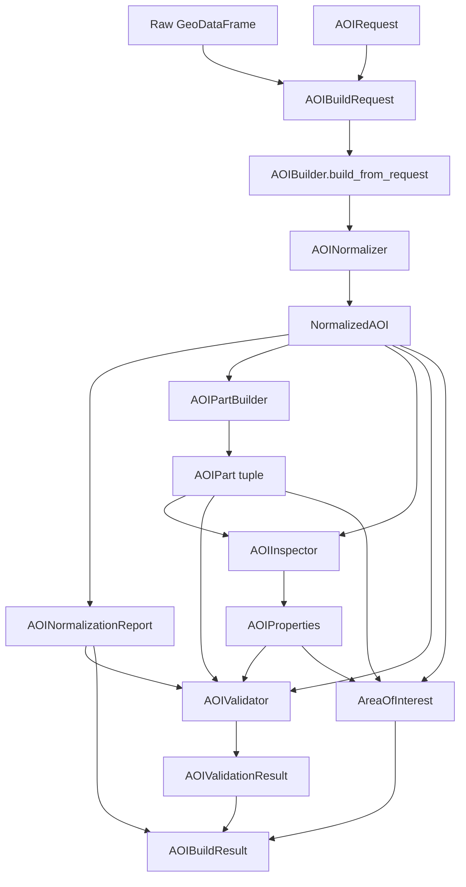
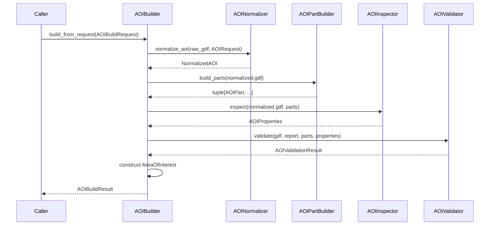
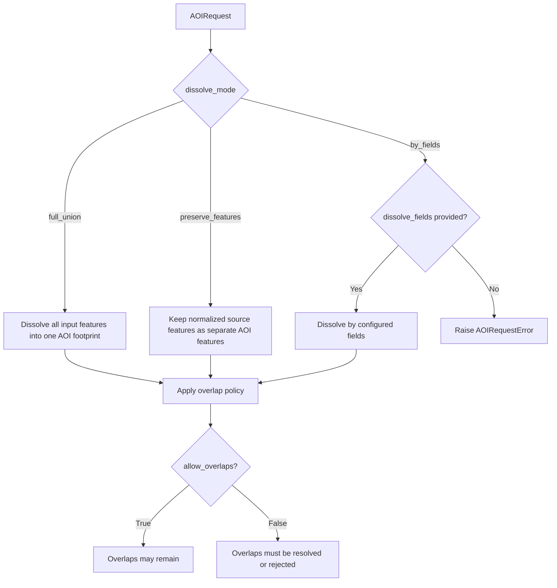
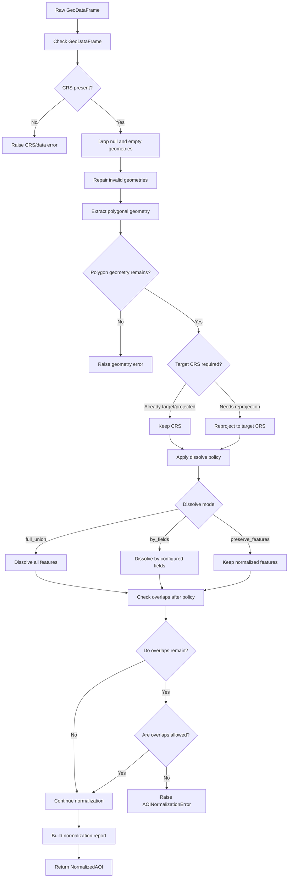
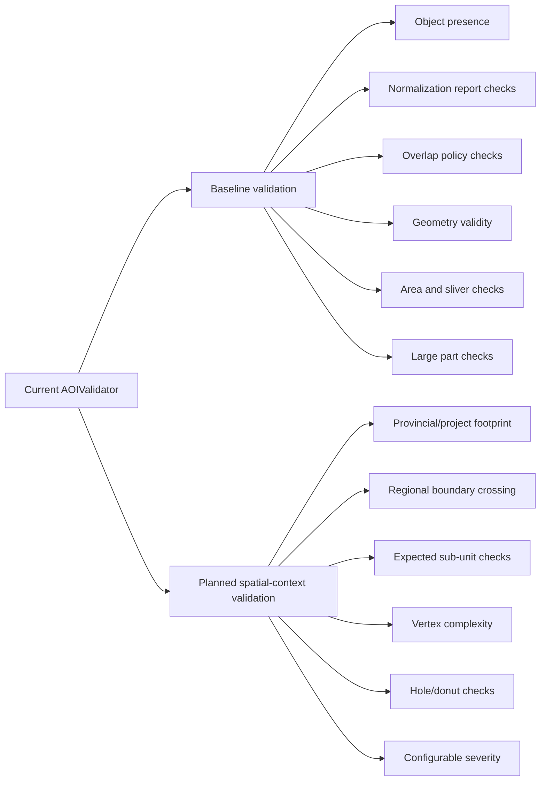
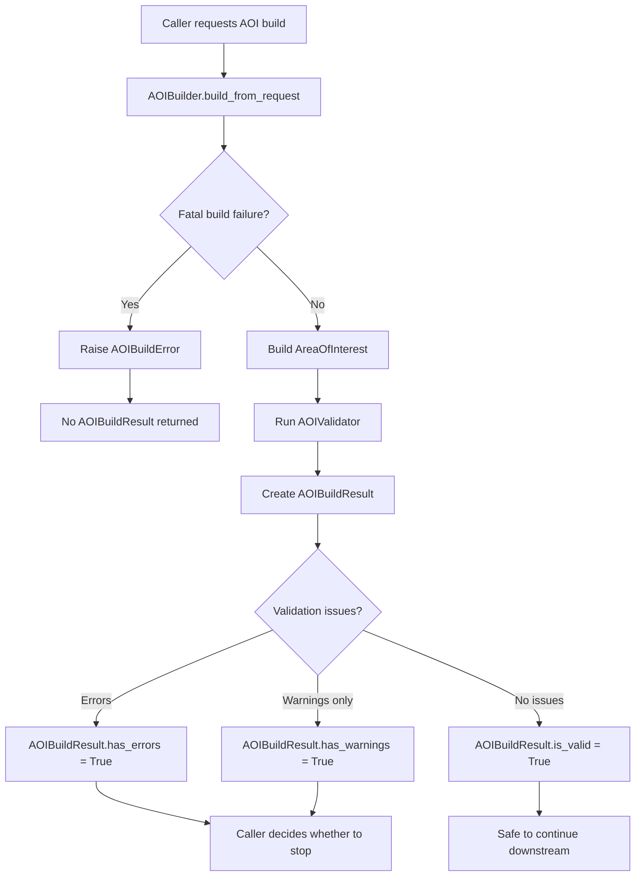

# AOI Builder

Internal workflow documentation for building a normalized `AreaOfInterest` from a raw `GeoDataFrame`.

This package takes raw AOI geometry, normalizes it into a canonical projected polygon dataset, builds singlepart AOI parts, derives AOI properties, runs the currently implemented validation checks, and returns an `AOIBuildResult`.

> **Internal status:** the normalization, part-building, inspection, and build-result flow are the current working implementation. The validation module exists and performs baseline checks, but the broader validation design is still in progress, especially configurable spatial-context validation such as provincial footprint checks, regional boundary checks, and configurable severity rules.

---

## Current Implementation Status

| Area | Status | Notes |
| --- | --- | --- |
| Request model | Implemented | `AOIRequest` validates AOI id, name, target CRS, dissolve mode, dissolve fields, and overlap policy. |
| Build request | Implemented | `AOIBuildRequest` combines an `AOIRequest` and raw `GeoDataFrame`. |
| Normalization | Implemented | Cleans raw geometry, repairs invalid geometry, extracts polygonal geometry, conforms CRS, applies dissolve policy, and builds an `AOINormalizationReport`. |
| Part building | Implemented | Explodes normalized AOI geometry into singlepart polygon `AOIPart` objects. |
| Inspection | Implemented | Builds `AOIProperties` from the normalized AOI footprint and parts. |
| Build result | Implemented | `AOIBuildResult` is success-only. Fatal build failures raise `AOIBuildError`. |
| Baseline validation | Implemented | Performs object presence, normalization-report, overlap-policy, validity, area, part-count, sliver, and large-part checks. |
| Spatial-context validation | In progress | Planned for provincial footprint, regional boundary, expected region/subunit, vertex complexity, holes/donuts, and configurable rule severity. |

---

## Workflow Summary

The AOI builder follows a staged workflow:

1. Receive an `AOIBuildRequest` containing an `AOIRequest` and raw `GeoDataFrame`.
2. Validate request-level configuration.
3. Normalize the raw geometry into a canonical projected polygon AOI.
4. Produce an `AOINormalizationReport` describing cleaning, repair, CRS, dissolve, and overlap-policy effects.
5. Build one or more `AOIPart` objects from the normalized AOI.
6. Inspect the normalized AOI and parts to produce `AOIProperties`.
7. Run the currently implemented `AOIValidator` checks.
8. Return an `AOIBuildResult` containing the built `AreaOfInterest`, validation result, and normalization report.




Sequence Diagram:



---

## Design Principles

The implementation separates spatial processing into small, testable stages:

| Object / Module | Responsibility |
| --- | --- |
| `AOIRequest` | Describes what AOI should be built and which normalization policy should be applied. |
| `AOIBuildRequest` | API input wrapper combining the request specification and raw input `GeoDataFrame`. |
| `AOINormalizer` | Converts raw input into a projected, valid, polygonal, policy-conformed AOI dataset. |
| `AOINormalizationReport` | Audit record describing what the normalizer did and what changed. |
| `NormalizedAOI` | Internal result containing the normalized `GeoDataFrame` and normalization report. |
| `AOIPartBuilder` | Builds singlepart polygon `AOIPart` objects from the normalized AOI. |
| `AOIPart` | Single AOI analysis unit with one-row `GeoDataFrame` and derived part-level properties. |
| `AOIInspector` | Computes read-only AOI-wide properties from the normalized AOI and parts. |
| `AOIProperties` | Derived spatial properties such as CRS, area, bounds, feature count, part count, vertex count, and Z/M flags. |
| `AOIValidator` | Reports validation issues for AOIs that can be built but may not meet processing policy. |
| `ValidationIssue` | One validation finding with `severity`, `code`, and `message`. |
| `AOIValidationResult` | Roll-up of validation issues with convenience properties for errors, warnings, and info messages. |
| `AreaOfInterest` | Canonical built AOI domain object used by downstream processing. |
| `AOIBuildResult` | Success-only result containing the AOI, validation result, and normalization report. |


---

## Basic Usage

```python
import geopandas as gpd

from aoi import AOIBuilder, AOIRequest
from aoi.models import AOIBuildRequest

raw_gdf = gpd.read_file("path/to/aoi.gpkg")

spec = AOIRequest(
    aoi_id="aoi_001",
    name="Example AOI",
    target_crs="EPSG:3005",
    dissolve_mode="full_union",
    dissolve_fields=(),
    allow_overlaps=False,
)

request = AOIBuildRequest(
    spec=spec,
    raw_gdf=raw_gdf,
)

builder = AOIBuilder()
result = builder.build_from_request(request)

aoi = result.aoi

if result.has_errors:
    for issue in result.errors:
        print(f"ERROR {issue.code}: {issue.message}")

if result.has_warnings:
    for issue in result.warnings:
        print(f"WARNING {issue.code}: {issue.message}")

print(aoi.aoi_id)
print(aoi.footprint_area_ha)
print(aoi.part_count)
```

---

## Exception Handling Strategy

The AOI builder uses a staged exception-handling strategy so failures can be reported with meaningful context. The intent is to preserve three levels of information:

1. **Root cause** — the low-level spatial, CRS, geometry, or unexpected Python error.
2. **Module context** — the AOI submodule where the failure occurred.
3. **Build-stage context** — the stage of the AOI build workflow that failed.

This makes it easier for callers, logs, and internal users to understand not only *what* failed, but *where* it failed.

### Exception hierarchy

All AOI-specific exceptions inherit from `AOIError`.

Shared spatial/data exceptions describe the underlying data problem:

| Exception | Purpose |
|---|---|
| `SpatialDataError` | Base exception for missing, malformed, or unusable spatial input data. |
| `DataCRSError` | Raised when spatial data has a missing, invalid, or incompatible CRS. |
| `SpatialGeometryError` | Raised when geometry is missing, empty, invalid, or unsupported. |

Module-level exceptions describe which AOI component failed:

| Exception | Raised by |
|---|---|
| `AOINormalizationError` | `AOINormalizer` |
| `AOIPartBuildError` | `AOIPartBuilder` |
| `AOIInspectionError` | `AOIInspector` |
| `AOIValidationError` | `AOIValidator` |
| `AOIBuildError` | `AOIBuilder` |

### Module-level wrapping

Each major AOI submodule is responsible for wrapping failures in its own module-level exception before reporting the error back to the builder.

For example, the inspector should report inspection failures as `AOIInspectionError`, even when the underlying root cause is a spatial data or geometry problem.

```python
try:
    ...
except AOIInspectionError:
    raise

except AOIError as exc:
    raise AOIInspectionError(
        "Failed to inspect normalized AOI properties."
    ) from exc

except Exception as exc:
    raise AOIInspectionError(
        "Unexpected error while inspecting normalized AOI properties."
    ) from exc

```

This preserves the original error using Python exception chaining while still making it clear that the failure occurred during inspection.

Example exception chain:

```text
AOIBuildError
    caused by AOIInspectionError
        caused by SpatialGeometryError
```

### Builder-level wrapping

`AOIBuilder` is responsible for orchestrating the workflow and adding build-stage context. Each stage is executed through `_run_stage(...)`, which receives:

* the stage name;
* the AOI ID used for logging and reporting;
* the operation to run;
* the keyword arguments passed to that operation.

The builder wraps AOI-specific failures in `AOIBuildError`.

```python
properties = self._run_stage(
    stage="inspection",
    build_aoi_id=spec.aoi_id,
    operation=self.inspector.inspect,
    gdf=normalized.gdf,
    parts=parts,
)
```

If inspection fails, the builder raises an `AOIBuildError` with the stage set to `"inspection"` while preserving the original module-level exception.

### Why this matters

Failures include the AOI ID, build stage, module exception type, and root cause.

Example log context:

```text
AOI build stage failed |
aoi_id=my_aoi |
stage=inspection |
error_type=AOIInspectionError |
root_error_type=SpatialGeometryError |
reason=Failed to inspect normalized AOI properties. |
root_reason=Normalized AOI footprint is empty after union.
```

### Design rule

The package follows this rule:

```text
Shared spatial/data exceptions describe the root problem.
Module-level exceptions describe where the problem occurred.
AOIBuildError describes which build stage failed.
```

For example:

```text
SpatialGeometryError
    ↓ wrapped by
AOIInspectionError
    ↓ wrapped by
AOIBuildError(stage="inspection")
```

This allows callers to catch one top-level exception, `AOIBuildError`, while still being able to inspect the exception chain for detailed diagnostics.

---

## Request Model

`AOIRequest` is the caller-facing specification for the AOI build.

```python
AOIRequest(
    aoi_id="aoi_001",
    name="Example AOI",
    target_crs="EPSG:3005",
    dissolve_mode="full_union",
    dissolve_fields=(),
    allow_overlaps=False,
)
```



### `dissolve_mode`

| Mode | Meaning | Typical Use |
| --- | --- | --- |
| `full_union` | Dissolve all input AOI features into one footprint. | Default canonical AOI build. |
| `by_fields` | Dissolve input features by configured `dissolve_fields`. | Grouped AOI units where attributes define meaningful AOI groups. |
| `preserve_features` | Keep normalized source features as separate AOI features. | Source features are meaningful processing units. |

### `allow_overlaps`

`allow_overlaps=False` means overlapping AOI polygons are not allowed after policy application. If overlaps remain after normalization policy is applied, the normalizer detects unresolved overlaps and raises a normalization/spatial error that is ultimately wrapped by AOIBuildError at the builder boundary.

---

## Normalization

`AOINormalizer` is responsible for converting raw spatial input into a normalized AOI.

Current responsibilities:

- validate that the input is a usable `GeoDataFrame`;
- drop null or empty geometries;
- repair invalid geometries with `make_valid`;
- extract polygonal geometry from repaired geometries;
- drop non-polygonal components;
- conform the AOI to the target projected CRS;
- apply the configured AOI dissolve policy;
- detect overlaps before and after policy application;
- build an `AOINormalizationReport` to be consumed by the AOI validation module.




---

## Normalization Report

`AOINormalizationReport` records the effects of normalization.

Important fields include:

| Field | Meaning |
| --- | --- |
| `input_feature_count` | Number of raw input features. |
| `cleaned_feature_count` | Number of features remaining after geometry cleaning and polygon extraction. |
| `output_feature_count` | Number of features after AOI policy application. |
| `input_crs` / `output_crs` | CRS before and after normalization. |
| `null_or_empty_removed_count` | Number of null or empty geometries removed. |
| `repair_input_feature_count` | Number of features evaluated for geometry repair. |
| `repaired_feature_count` | Number of invalid geometries repaired. |
| `polygon_extract_drop_count` | Number of non-polygonal components dropped. |
| `policy_name` | Applied dissolve policy. |
| `dissolve_fields_used` | Fields used for `by_fields` dissolve mode. |
| `allow_overlaps` | Whether overlaps were allowed by request policy. |
| `overlaps_detected_before_policy` | Whether overlaps existed before dissolve policy. |
| `overlaps_present_after_policy` | Whether overlaps remained after dissolve policy. |
| `overlaps_resolved_by_policy` | Whether the policy resolved overlaps. |
| `was_reprojected` | Whether the AOI was reprojected during normalization. |

---

## AOI Parts

`AOIPartBuilder` builds one `AOIPart` per singlepart polygon in the normalized AOI.

Each `AOIPart` stores:

- `part_id`;
- `parent_aoi_id`;
- `part_index`;
- geometry type;
- one-row `GeoDataFrame`;
- bounds;
- area in hectares;
- vertex count;
- Z/M flags.

---

## Inspection and AOI Properties

`AOIInspector` computes stable, read-only properties for the normalized AOI.

`AOIProperties` contains derived spatial metadata for the built `AreaOfInterest`. These values are calculated after normalization and part-building, and are intended to help downstream tools understand the AOI footprint, geometry complexity, CRS, and suitability for processing.

| Property                   | Description                                                                                       | Why it matters                                                                                                                                                    |
| -------------------------- | ------------------------------------------------------------------------------------------------- | ----------------------------------------------------------------------------------------------------------------------------------------------------------------- |
| `crs_epsg`                 | EPSG code for the AOI coordinate reference system, when one can be resolved.                      | Confirms the AOI is using the expected projected CRS for spatial analysis, area calculation, and overlay processing.                                              |
| `crs_string`               | String representation of the AOI coordinate reference system.                                     | Provides a readable CRS value for logging, reporting, debugging, and cases where an EPSG code may not be available.                                               |
| `footprint_area_ha`        | Area, in hectares, of the AOI footprint after full AOI union of all features has been applied. | Represents the effective AOI area or landbase area of coverage by the application.                                  |
| `parts_area_ha`            | Combined area, in hectares, of all AOI parts.                                                     | Provides the total area of analysis by the application. If overlaps are preserved, this value may be greater than the footprint area (landbase) due to duplicate coverage amongst parts.                           |
| `parts_to_footprint_ratio` | Ratio of `parts_area_ha` to `footprint_area_ha`.                                                  | Identifies whether AOI parts align cleanly with the final footprint. A value near `1.0` usually indicates no meaningful duplication or overlap between parts. |
| `bounds`                   | Bounding box for the AOI as `(minx, miny, maxx, maxy)`.                                           | Useful for quick spatial indexing, map zooming, extent checks, and coarse spatial filtering before more expensive geometry operations.                            |
| `feature_count`            | Number of features in the normalized AOI GeoDataFrame.                                            | Indicates how many normalized records remain after cleaning, polygon extraction, and dissolve policy processing.                                         |
| `part_count`               | Number of `AOIPart` objects created from the normalized AOI.                                      | Represents the number of singlepart AOI units available for downstream processing. Multipart or preserved-feature AOIs may produce more than one part.            |
| `geometry_type`            | Geometry type of the normalized AOI, such as `Polygon` or `MultiPolygon`.                         | Helps confirm that the AOI contains polygonal geometry suitable for area-based spatial processing.                                                                |
| `vertex_count`             | Sum total number of vertices across all AOI part geometries.                                                 | Provides a measure of geometry complexity. High vertex counts can affect overlay performance and may trigger validation warnings or processing limits.            |
| `max_vertices_per_part`    | Highest vertex count found on any individual AOI part.                                            | Helps identify a single complex part that may cause processing issues, even when the total AOI vertex count is acceptable.                                        |
| `has_z`                    | Indicates whether any AOI part geometry contains Z coordinates.                                        | Flags 3D coordinate values. Most AOI processing is expected to be 2D, so Z values may be ignored or handled explicitly by downstream tools.                       |
| `has_m`                    | Indicates whether any AOI geometry contains M values.                                             | Flags measured geometry values. M values are not typically used in AOI overlay processing but may be important to detect for data-quality awareness.              |


---

## Validation

`AOIValidator` is intentionally separate from normalization and inspection.

The current validator reports issues for AOIs that were successfully built. It does not currently accept spatial validation context layers.

### Currently implemented checks

| Check | Example Code | Current Severity |
| --- | --- | --- |
| Missing or empty AOI `GeoDataFrame` | `NO_GDF` | error |
| Missing properties | `NO_PROPERTIES` | error |
| Missing parts | `NO_PARTS` | error |
| Missing normalization report | `NO_NORMALIZATION_REPORT` | error |
| Overlaps remain after policy when overlaps are not allowed | `OVERLAPS_PRESENT` | error |
| Null, empty, or non-polygonal features removed during normalization | `NULL_OR_NON_POLYGONS_REMOVED` | warning |
| Invalid geometry remains | `INVALID_GEOMETRY` | error |
| AOI has zero or negative area | `ZERO_AREA` | error |
| Inspector part count does not match built parts | `PART_COUNT_MISMATCH` | error |
| Part is below sliver threshold | `ZERO_AREA_OR_SLIVER_PART` | error |
| Part exceeds large-area threshold | `LARGE_PART` | error |

### Validation work in progress

The validation layer is the least stable part of the AOI builder design. The current intent is to expand it without changing the responsibilities of the normalizer, part builder, or inspector.

Planned validation work includes:

- maximum vertex count per part;
- geometry complexity checks, including holes/donuts;
- AOI overlap with a provincial or project footprint;
- AOI partially outside expected processing bounds;
- AOI crossing sub-unit or management-unit boundaries (region, zone, district, etc.);
- AOI outside an expected sub-unit layer;
- configurable severity by validation rule;
- optional spatial validation context supplied by the caller or application layer.

Until this is implemented, downstream callers should treat `AOIValidationResult` as a baseline quality report, not as the final policy gate for all spatial processing rules.




---

## Build Result and Error Boundary

`AOIBuildResult` currently represents a successful build. If the AOI cannot be built, `AOIBuilder` raises `AOIBuildError`.

This means there are two categories of failure:

| Category | Behavior | Examples |
| --- | --- | --- |
| Fatal build failure | Raises `AOIBuildError` | Missing CRS, invalid target CRS, empty input, no polygonal geometry after cleaning, part-building failure. |
| Validation issue | Returned in `AOIValidationResult` | Remaining overlaps, sliver parts, large parts, normalization warnings. |

Caller pattern:

```python
try:
    result = builder.build_from_request(request)
except AOIBuildError as exc:
    # AOI could not be built.
    raise

if result.has_errors:
    # AOI was built, but validation found policy or quality errors. Did not meet specification.
    pass

if result.has_warnings:
    # AOI was built and may be usable after review. Could cause performance issue downstream.
    pass
```



---

## Logging Boundary

Logging should remain concentrated at useful stage boundaries.

| Layer | Logging Responsibility |
| --- | --- |
| `AOINormalizer` | Geometry cleaning counts, CRS conformity, policy applied, overlap state. |
| `AOIPartBuilder` | Part count, total part area, total vertices, Z/M flags. |
| `AOIInspector` | Footprint area, parts area, ratio, bounds, vertex counts. |
| `AOIValidator` | Number and type of validation issues. |
| `AOIBuilder` | Build start, successful completion, validation summary, wrapped fatal build errors. |

Lower-level modules raise clear domain exceptions; the builder should wrap expected AOI exceptions as `AOIBuildError` for callers.

---

## Internal Notes / Next Steps

These items will be resolved as the module stabilizes:

1. Finalize the validation-context design.
2. Add unit tests for each stage using low-level geometry fixtures.
3. Add integration tests for spatial-context validation once regional/provincial validation layers are introduced.
4. Update README.md with any changes made, particularly the validation process.