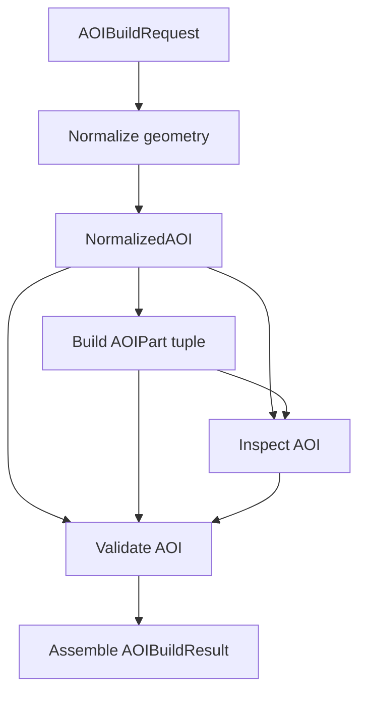
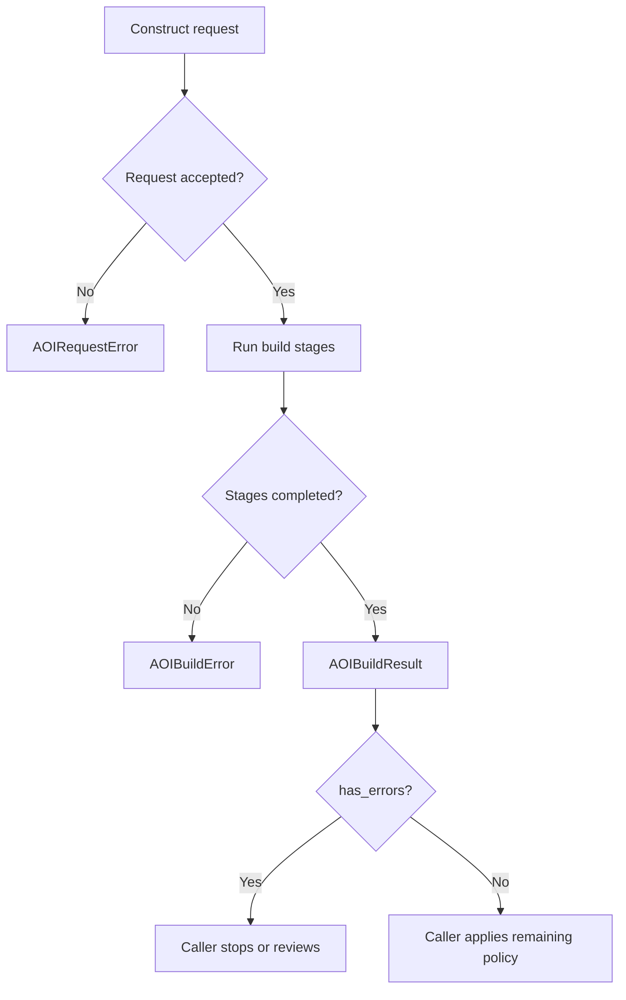

# AOI Builder

Build a normalized `AreaOfInterest` from a raw `GeoDataFrame` for downstream spatial analysis and reporting.

The package validates request configuration, cleans and reprojects polygon geometry, applies dissolve and overlap policy, builds singlepart analysis units, calculates spatial properties, and returns an `AOIBuildResult` containing the AOI, validation findings, and normalization report.

**A completed build does not mean validation passed.** Fatal stage failures raise `AOIBuildError`. Completed builds return a result whose `has_errors` and `has_warnings` properties let the caller decide whether to continue.

## Basic usage

The following example uses the package within `ast_engine` and explicitly stops processing when validation returns errors:

```python
import logging

import geopandas as gpd

from ast_engine.core.aoi import AOIBuilder, AOIBuildRequest, AOIRequest
from ast_engine.core.aoi.exceptions import AOIValidationError

logger = logging.getLogger(__name__)

raw_gdf = gpd.read_file("path/to/aoi.gpkg")

# Request configuration is validated here, during construction.
spec = AOIRequest(
    aoi_id="aoi_001",
    name="Example AOI",
    target_crs="EPSG:3005",
    dissolve_mode="full_union",
    dissolve_fields=(),
    allow_overlaps=False,
)

request = AOIBuildRequest(spec=spec, raw_gdf=raw_gdf)
result = AOIBuilder().build_from_request(request)

for issue in result.warnings:
    logger.warning("%s: %s", issue.code, issue.message)

if result.has_errors:
    messages = "; ".join(
        f"{issue.code}: {issue.message}" for issue in result.errors
    )
    # Caller policy: do not pass this AOI to downstream analysis.
    raise AOIValidationError(messages)

aoi = result.aoi

print(aoi.aoi_id)
print(aoi.footprint_area_ha)
print(aoi.part_count)
```

The caller raises `AOIValidationError` in this example. The current builder does not automatically raise it for returned validation findings. A review interface can instead retain the result and display its issues.

Invalid request configuration raises `AOIRequestError` during construction. Failures within build stages raise `AOIBuildError`. Handle those exceptions at the application's service or user-interface boundary.

## Current implementation status

| Area | Current behavior |
| --- | --- |
| Request model | Validates IDs, name, target CRS, dissolve configuration, and overlap policy during construction. |
| Build request | Combines the specification and raw GeoDataFrame; rejects `None` for either field. |
| Normalization | Cleans geometry, extracts polygon components, standardizes geometry columns, conforms CRS, applies policy, and records its effects. |
| Part building | Produces one valid polygon per `AOIPart`, preserving CRS and attributes retained by normalization. |
| Inspection | Computes footprint, parts-area, CRS, count, and geometry-complexity metadata. |
| Baseline validation | Reports cleanup findings, disallowed overlaps, invalid geometry, non-positive area, part-count mismatch, slivers, and large parts. |
| Build result | Returns the AOI, validation result, and normalization report when all build stages complete. |
| Spatial-context and complexity rules | Planned. The injected `SpatialValidator` is stored but not invoked; maximum-vertex and hole rules are not implemented. |

Baseline validation covers the implemented rules only. A valid result does not establish compliance with future regional, provincial, or project-specific rules.

## Workflow and responsibilities

`AOIRequest` validates its own configuration before it is placed in an `AOIBuildRequest`. The builder then runs four stages in order:

| Stage | Operation | Output |
| --- | --- | --- |
| `normalization` | `AOINormalizer.normalize_aoi(gdf, request)` | `NormalizedAOI`, containing geometry and its audit report. |
| `part_building` | `AOIPartBuilder.build_parts(aoi_id=..., gdf=...)` | Tuple of singlepart `AOIPart` objects. |
| `inspection` | `AOIInspector.inspect(gdf, parts)` | `AOIProperties`. |
| `validation` | `AOIValidator.validate(gdf=..., report=..., parts=..., properties=...)` | `AOIValidationResult`. |

After validation returns, the builder constructs `AreaOfInterest` and `AOIBuildResult`. The diagram shows which outputs each stage consumes:


```mermaid
flowchart TD
    Request["AOIBuildRequest"] --> Normalize["Normalize geometry"]
    Normalize --> Normalized["NormalizedAOI"]
    Normalized --> Parts["Build AOIPart tuple"]
    Normalized --> Inspect["Inspect AOI"]
    Parts --> Inspect
    Normalized --> Validate["Validate AOI"]
    Parts --> Validate
    Inspect --> Validate
    Validate --> Result["Assemble AOIBuildResult"]
```

`NormalizedAOI` supplies the cleaned geometry and normalization report; the report accompanies the geometry into validation and the final result.

The responsibilities remain separate:

- **Normalization** transforms input geometry and enforces its output contract.
- **Part building** creates individual polygon analysis units.
- **Inspection** computes metadata without applying quality thresholds.
- **Validation** evaluates the supplied geometry, report, parts, and properties against baseline rules.
- **The caller** decides what returned findings mean for downstream processing.

### Module map

| File | Responsibility |
| --- | --- |
| `aoi_builder.py` | Orchestration, dependency injection, stage failures, and build summaries. |
| `models.py` | Request, AOI, part, property, report, validation, and build-result dataclasses. |
| `normalizer.py` | Geometry cleaning, CRS conformity, dissolve policy, and strict output checks. |
| `normalization_reporter.py` | Mutable reporting state and final immutable normalization report. |
| `parts_builder.py` | Singlepart geometry and AOIPart construction. |
| `inspector.py` | AOI-wide spatial and complexity metadata. |
| `validator.py` | Baseline validation findings and the future spatial-validator injection point. |
| `utils.py` | Shared GeoDataFrame/CRS checks, overlap detection, and vertex/Z/M helpers. |
| `exceptions.py` | AOI exception hierarchy, build-stage metadata, and `root_cause()`. |
| `constants.py` | Default CRS (`EPSG:3005`) and geometry column (`geometry`). |
| `__init__.py` | Public builder and model exports. |

Custom normalizers, inspectors, validators, and part builders may be supplied to `AOIBuilder`. Defaults are created only for arguments that are `None`.

## Request and input contracts

### AOIRequest

| Field | Default | Contract |
| --- | --- | --- |
| `aoi_id` | Required | Non-empty string after trimming. |
| `name` | Required | Non-empty string after trimming. |
| `target_crs` | `"EPSG:3005"` | String accepted by pyproj; must be projected and use metres. |
| `dissolve_mode` | `"full_union"` | One of `full_union`, `by_fields`, or `preserve_features`; case and surrounding whitespace are normalized. |
| `dissolve_fields` | `()` | Tuple or list of strings, normalized to a trimmed tuple with blank entries removed. Duplicates are rejected after normalization. |
| `allow_overlaps` | `False` | Boolean; controls whether overlaps may remain after policy application. |

`by_fields` requires at least one dissolve field. The other modes reject non-empty dissolve fields. Existence of the named columns is checked during normalization, when the input data is available.

The request exposes `target_crs_obj`, `target_epsg`, and `is_projected`. An EPSG code is optional: a custom metric projected CRS can be valid even when `target_epsg` is `None`.

The current metre check examines the first CRS axis's unit name. Direct calls to lower-level helpers are not a substitute for request validation: some helpers check projection without checking metre units.

### AOIBuildRequest and raw data

`AOIBuildRequest` holds `spec: AOIRequest` and `raw_gdf: GeoDataFrame`. It rejects missing values but does not comprehensively validate their runtime types. Use the declared types; the normalizer performs the GeoDataFrame checks.

Raw input must be a non-empty GeoDataFrame with an active geometry column and a defined CRS. It may contain null, empty, invalid, geographic, multipart, or mixed geometry that the normalizer can clean.

At least one usable polygon must remain after repair and extraction. Lines and points are discarded; they are not automatically buffered into polygon AOIs. Prepare buffers upstream if those features are intended to define an area.

## Normalization and dissolve policies

The normalizer works on a copy of the input and performs these steps:

1. Check the input GeoDataFrame and source CRS.
2. Remove secondary columns with a geometry dtype and standardize the active geometry column name to `geometry`.
3. Remove null and empty geometry.
4. Repair invalid geometry with `make_valid`.
5. Recursively extract polygons from collections and multipart geometry; discard non-polygon components and rows with no usable polygon.
6. Reproject to the target CRS if the source and target are not equivalent.
7. Check that the cleaned geometry is projected, valid, non-empty, and polygonal.
8. Apply the requested dissolve policy and check overlaps before and after it.
9. Check the normalized output and finalize its report.

Geometry-column changes are recorded in report notes. If a non-geometry column already named `geometry` prevents renaming the active column, normalization fails rather than overwriting that attribute.

A source being projected is not enough to skip reprojection: its CRS must match the requested target.

### Dissolve behavior and retained attributes

| Mode | Geometry behavior | Output attributes |
| --- | --- | --- |
| `full_union` | Union all cleaned features into one normalized feature. Its geometry may be a Polygon or MultiPolygon. | Geometry only. |
| `by_fields` | Dissolve within the configured groups. Null grouping values are retained through `dropna=False`. | Dissolve fields and geometry only; other attributes are removed. |
| `preserve_features` | Keep cleaned source rows without dissolving across rows. Repair and extraction may still change each row's geometry. | Non-geometry attributes plus the standardized active geometry column. |

The active geometry column cannot be used as a dissolve field. Grouped dissolution can resolve overlaps within groups while leaving overlaps between different groups.

### Overlap policy

An overlap means that two features intersect with positive area. Shared edges and corner touches do not count. Spatial-index candidates reduce unnecessary comparisons; the helper still calculates intersection area for candidate pairs.

Normalization uses an area tolerance of zero. `AOIRequest` does not currently expose a tolerance option.

| Policy setting and output | Behavior |
| --- | --- |
| `allow_overlaps=False`, no overlaps remain | Continue. |
| `allow_overlaps=False`, overlaps remain | Fail normalization; the builder raises `AOIBuildError`. |
| `allow_overlaps=True`, overlaps remain | Continue and record the overlap state in the report. |

Allowing overlaps does not force a policy to preserve them: `full_union` still unions the geometry. Allowed overlaps alone do not generate a validation warning.

## Normalization report

`AOINormalizationReportBuilder` accumulates events through named methods and checks that required values are populated. It then constructs a frozen `AOINormalizationReport`.

The final report is available at `result.normalization_report`.

| Field | Meaning |
| --- | --- |
| `input_feature_count` | Raw input rows. |
| `cleaned_feature_count` | Rows remaining after cleaning and polygon extraction. |
| `output_feature_count` | Rows after dissolve policy. |
| `input_crs` / `output_crs` | CRS before and after normalization. |
| `was_reprojected` | Whether a CRS transformation was performed. |
| `null_or_empty_removed_count` | Rows removed for null/empty geometry, including rows that become unusable after polygon extraction. |
| `repair_input_feature_count` | Features examined for validity before repair/extraction. |
| `repaired_feature_count` | Features that were invalid and passed through `make_valid`. |
| `polygon_extract_input_feature_count` | Individual non-empty components examined after repair. |
| `polygon_extract_output_feature_count` | Polygon components retained before union within the source feature. |
| `polygon_extract_drop_count` | Non-polygon components discarded. |
| `policy_name` / `dissolve_fields_used` | Dissolve configuration applied. |
| `allow_overlaps` | Requested overlap policy. |
| `policy_applied` | Whether policy application completed. |
| `policy_input_feature_count` / `policy_output_feature_count` | Row counts before and after policy. |
| `overlaps_detected_before_policy` | Whether overlap existed before policy. |
| `overlaps_present_after_policy` | Whether overlap remained after policy. |
| `overlaps_resolved_by_policy` | True when overlap existed before policy and none remained afterward. |
| `notes` | Reprojection and geometry-column actions. |

Despite their names, the `polygon_extract_*_feature_count` fields count components, not source rows. A nested collection can contain multiple retained or discarded components. Collection containers and empty components do not count.

A discarded component and a removed source row can describe the same cleanup event at different levels. Do not add the component and row counts together to estimate unique affected features.

## AOI parts and properties

### Singlepart analysis units

Each `AOIPart` contains one valid Polygon in a one-row GeoDataFrame. The part builder preserves the normalized CRS and the attributes retained by the dissolve policy.

Parts include `part_id`, `parent_aoi_id`, `part_index`, `geom_type`, `gdf`, `bounds`, `area_ha`, `vertex_count`, `has_z`, and `has_m`. The `geometry` and `crs` properties provide convenient access to the part's spatial data.

Part indexes are one-based. IDs use zero padding, such as `aoi_001_part_0001`, and follow normalized/exploded output order. They are not persistent identifiers for matching the same geometry across reordered builds.

### Inspection snapshot

`AOIInspector` computes a frozen `AOIProperties` snapshot after part building.

| Property | Meaning |
| --- | --- |
| `crs_epsg` | Optional EPSG code (`int` or `None`). Its presence alone does not validate the target CRS or spatial location. |
| `crs_string` | CRS representation for reporting and consumers that do not require an EPSG code. |
| `footprint_area_ha` | Unique area of the union of all normalized features, in hectares. |
| `parts_area_ha` | Sum of all part areas, including duplicate coverage where parts overlap. |
| `parts_to_footprint_ratio` | `parts_area_ha / footprint_area_ha`; expresses duplicated area coverage. |
| `bounds` | `(minx, miny, maxx, maxy)` in target-CRS coordinates. |
| `feature_count` | Number of normalized GeoDataFrame rows. |
| `part_count` | Number of singlepart AOIPart objects. |
| `geometry_type` | `Polygon`, `MultiPolygon`, or a mixed-type description when normalized rows contain both types. |
| `vertex_count` | Sum of coordinates across all part rings, including holes and repeated closing coordinates. |
| `max_vertices_per_part` | Largest vertex count in an individual part. |
| `has_z` / `has_m` | Whether any part reports Z/M coordinates through the installed geometry library. |

The inspector calculates unioned footprint area for every dissolve mode; this calculation does not replace the normalized features. A single multipart normalized feature can therefore have `feature_count=1` and several AOI parts.

For example, two overlapping 1 ha parts with a unique footprint of 1.5 ha have `parts_area_ha=2.0` and a ratio of approximately `1.3333`. The ratio describes area duplication; it does not validate external boundaries or replace the overlap policy.

Area conversion divides square metres by 10,000 and depends on the metric target-CRS contract. Z/M metadata does not imply three-dimensional area calculations or guaranteed preservation of those ordinates through every spatial operation. A missing Z/M attribute is reported as false by the helper.

### Mutability

`AOIRequest`, `AOIProperties`, `AOIPart`, `AOINormalizationReport`, `ValidationIssue`, `AOIValidationResult`, and `AOIBuildResult` are frozen dataclasses. `AOIBuildRequest` is also frozen. `AreaOfInterest` and the contained GeoDataFrames remain mutable.

Freezing a dataclass prevents reassignment of its fields; it does not freeze a contained GeoDataFrame. Changing geometry can make stored areas, counts, bounds, or validation findings stale. Treat built AOI geometry as a snapshot, or rebuild/recompute its metadata after changes.

## Validation

The validator consumes normalized geometry, its report, parts, and inspected properties. It expects these inputs to be present. It does not currently produce `NO_GDF`, `NO_PROPERTIES`, `NO_PARTS`, or `NO_NORMALIZATION_REPORT` findings.

The normal builder workflow establishes usable inputs through earlier stages. Direct callers must provide those inputs themselves.

### Implemented findings

| Check | Code | Severity |
| --- | --- | --- |
| Report indicates disallowed overlaps remain | `OVERLAPS_PRESENT` | Error |
| Null, empty, or non-polygon geometry was removed | `NULL_OR_NON_POLYGONS_REMOVED` | Warning |
| Invalid geometry remains | `INVALID_GEOMETRY` | Error |
| Footprint or summed parts area is zero or negative | `ZERO_AREA` | Error |
| Recorded part count differs from the supplied parts | `PART_COUNT_MISMATCH` | Error |
| Part area is **at or below 0.1 ha** | `ZERO_AREA_OR_SLIVER_PART` | Error |
| Part area is **at or above 10,000 ha** | `LARGE_PART` | Error |

Threshold checks report issues; they do not delete slivers or split large parts. The threshold values and severities are currently module constants.

The overlap rule is defensive: with the standard normalizer, disallowed overlaps already fail the normalization stage. Invalid geometry and some area checks also defend assumptions established by earlier stages.

`ValidationIssue` normalizes severity to lowercase, codes to uppercase, and surrounding message whitespace. Unsupported severity or blank code/message values raise `ValueError` during issue construction.

### Validation result

`AOIValidationResult` stores issues and derives its status from them:

| Property | Meaning |
| --- | --- |
| `is_valid` | No error-severity issues exist. Warnings and informational issues do not make it false. |
| `has_errors` | At least one error exists. |
| `has_warnings` | At least one warning exists. |
| `errors` / `warnings` / `infos` | Issues filtered by severity. |

`AOIBuildResult` exposes the same convenience properties and retains the full validation result at `result.validation`.

### Planned validation

These rules are not implemented:

- provincial or project-footprint checks;
- expected-region, district, zone, or management-unit checks;
- boundary crossing and AOI extent policy;
- maximum-vertex and hole/donut checks;
- configurable severity and threshold values;
- use of caller-supplied spatial validation context.

`MAX_VERTICES = 10_000` is declared but not enforced. Vertex properties are currently informational metadata.

`AOIValidator(spatial_validator=...)` stores the supplied object without invoking it. The current source imports `SpatialValidator` from `ast_engine.core.validation.spatial_validation` at runtime, so that module must be available to import this package. The injection point does not yet provide spatial-context validation.

## Build result and error boundary

`AOIBuildResult` contains `aoi`, `validation`, and `normalization_report`. It represents completion of all build stages, not an assertion that validation passed.

| Outcome | Behavior |
| --- | --- |
| Invalid request configuration, including invalid/non-metric target CRS | `AOIRequestError` during request construction. |
| Missing `spec` or `raw_gdf` in a build request | `AOIRequestError` during build-request construction. |
| Stage cannot complete, such as missing input CRS, no usable polygons, or disallowed remaining overlaps | `AOIBuildError`; no result is returned. |
| Validation execution raises an exception | `AOIBuildError` with stage `validation`; no result is returned. |
| Stages complete with validation errors | Result has `has_errors=True` and `is_valid=False`. |
| Stages complete with warnings but no errors | Result has `has_warnings=True` and `is_valid=True`. |
| Stages complete without validation errors | Result has `is_valid=True`; the caller applies any remaining processing rules. |


```mermaid
flowchart TD
    Request["Construct request"] --> Accepted{"Request accepted?"}
    Accepted -- No --> RequestError["AOIRequestError"]
    Accepted -- Yes --> Build["Run build stages"]
    Build --> Complete{"Stages completed?"}
    Complete -- No --> BuildError["AOIBuildError"]
    Complete -- Yes --> Result["AOIBuildResult"]
    Result --> Errors{"has_errors?"}
    Errors -- Yes --> Review["Caller stops or reviews"]
    Errors -- No --> Policy["Caller applies remaining policy"]
```

The stage wrapper covers the four operations listed in the workflow table. It is not a catch-all around malformed untyped calls: initial request access and final object assembly occur outside `_run_stage()`.

## Exception handling

AOI domain exceptions share the `AOIError` base class:

| Exception | Role |
| --- | --- |
| `AOIRequestError` | Invalid request configuration. |
| `SpatialDataError` | Missing, malformed, or unusable spatial input. |
| `DataCRSError` | A `SpatialDataError` for CRS problems. |
| `SpatialGeometryError` | A `SpatialDataError` for geometry problems. |
| `AOINormalizationError` | Expected normalization failures. |
| `AOIPartBuildError` | Expected part-building failures. |
| `AOIInspectionError` | Expected inspection failures. |
| `AOIValidationError` | Available to callers enforcing validation policy; the current validator does not raise it for findings. |
| `AOIBuildError` | Build-stage failure, with optional `stage` and `aoi_id` metadata. |

Normalization, part building, and inspection wrap their expected data/domain failures and preserve their causes using `raise ... from exc`. They allow unexpected exceptions to reach the builder. The validator currently returns findings without its own stage-specific exception wrapping.

`AOIBuilder._run_stage()` wraps expected AOI errors and unexpected exceptions in `AOIBuildError`. An existing `AOIBuildError` is re-raised unchanged.

For a missing source CRS, a typical chain is:

| Level | Exception | Information |
| --- | --- | --- |
| Builder | `AOIBuildError` | AOI ID and `stage="normalization"`. |
| Module | `AOINormalizationError` | Normalization context. |
| Root cause | `DataCRSError` | Input CRS is missing. |

Use `exc.__cause__` for the immediate wrapped exception and `root_cause(exc)` for the deepest explicit cause. The helper follows `__cause__`; it does not traverse implicit `__context__` links.

```python
from ast_engine.core.aoi.exceptions import AOIBuildError, root_cause

try:
    result = builder.build_from_request(request)
except AOIBuildError as exc:
    cause = root_cause(exc)
    # The application can present this context to the user or record it.
    failure_details = {
        "aoi_id": exc.aoi_id,
        "stage": exc.stage,
        "cause_type": type(cause).__name__,
        "reason": str(cause),
    }
    raise
```

This fragment assumes `builder` and a correctly constructed `request` already exist. Request-construction failures are handled separately as `AOIRequestError`.

## Logging

Modules obtain loggers with `logging.getLogger(__name__)`. The application configures handlers, formatting, and levels.

| Component | Actual logging behavior |
| --- | --- |
| Normalization reporter | Debug summaries of cleanup, CRS, policy counts, and overlap state. |
| Part builder | Debug summary of part count, area, vertices, and Z/M flags. |
| Inspector | Debug summary of spatial properties and complexity. |
| Validator | Returns issues; currently does not emit a validation summary itself. |
| Builder | Info messages for build start/completion and passed or warning-only validation summaries; warning-level summary when validation contains errors. |
| Builder stage wrapper | Error log for expected AOI failures, root traceback at debug level; exception log with traceback for unexpected failures. |

The builder's validation summary reports counts. Callers can present or log individual issue codes/messages as needed. Avoid logging the same traceback again at every layer.

## Testing

The AOI suite uses generated geometry and in-memory GeoDataFrames to test behavior with known areas, bounds, overlap, and multipart structure. Shared geometry helpers are tested separately so changes to test data do not silently change the scenarios exercised by the AOI tests.

| Test module | Behaviors exercised |
| --- | --- |
| `test_aoi_request.py` | Defaults; string and field normalization; invalid input types; supported policies; metric projected CRS requirements; custom CRS without EPSG; immutable request fields. |
| `test_aoi_normalizer.py` | Null/empty removal; invalid-polygon repair; nested collection extraction and counts; secondary geometry removal; active-column standardization; reprojection; all dissolve policies; null groups; overlaps; source preservation. |
| `test_aoi_normalization_reporter.py` | Accumulated counts and notes; required reporting steps; overlap-resolution state; CRS metadata; immutable completed reports; isolation between runs. |
| `test_aoi_parts_builder.py` | Singlepart output; ordered padded IDs; row-index independence; attributes and dtypes; CRS; holes and vertices; Z and conditional M preservation; source/sibling isolation; invalid inputs. |
| `test_aoi_inspector.py` | Unioned footprint versus summed part areas; area ratios; feature/part counts; bounds; custom CRS; vertex and Z/M aggregation; unchanged inputs; stage exceptions. |
| `test_aoi_builder_orchestration.py` | Correct stage order and arguments; result assembly; returned validation findings; exception chains and stage metadata; stopping later stages after failure; default and explicitly supplied dependencies. |
| `test_aoi_builder.py` | AOI stages together for union, multipart splitting, large-part findings, missing CRS, and disallowed overlaps. |
| `test_aoi_geometry.py` | Geometry-factory shapes, dimensions, negative scenarios, attributes, and fresh independent GeoDataFrames. |

The component tests exercise individual AOI responsibilities. Orchestration tests use mocked dependencies to check the builder independently of spatial calculations. Workflow tests run the real stages together on generated input. All supplied modules currently carry the `unit` marker.

### Running the suite

Run from the repository root using the project environment. The `ast_engine` package and its shared test helpers must be importable.

```bash
uv run pytest ast_engine/tests/unit/aoi --collect-only -q
uv run pytest ast_engine/tests/unit/aoi -q -ra
```

The first command shows which tests are collected; the second runs them and reports non-passing outcomes, including skip reasons.

The tests require the shared modules under `ast_engine.tests.helpers`, including `aoi_geometry`, `aoi_requests`, and `aoi_assertions`. Running only a copied AOI test folder without these helpers does not provide the complete test environment.

## Migration from the prototype

| Previous use | Current use |
| --- | --- |
| `builder.from_gdf(spec, raw_gdf)` | `builder.build_from_request(AOIBuildRequest(spec=spec, raw_gdf=raw_gdf))` |
| Returned `AreaOfInterest` | `result.aoi` |
| `raise_errors=True/False` | Caller checks `result.has_errors` and applies its stop/continue policy. |
| `aoi.validation` | `result.validation` |
| `aoi.normalization_report` | `result.normalization_report` |
| `overlay_area_ha` | `parts_area_ha` |
| `AOIValidationResult(is_valid=..., issues=...)` | `AOIValidationResult(issues=...)` |
| Positional `build_parts(aoi_id, gdf)` | Keyword-only `build_parts(aoi_id=..., gdf=...)` |
| Unpadded part IDs | Zero-padded IDs based on output order. |

Also review consumers of grouped attributes, null groups, geometry-column names, and EPSG codes. Update direct AOI/part/property construction in tests for the expanded model fields. The old `AOIGeometryError` and `AOIGeometryTypeError` classes have been replaced by the shared spatial geometry exception hierarchy.

## Internal next steps

1. Finalize spatial-context validation and its interface before invoking the injected validator.
2. Decide whether `SpatialValidator` should remain a runtime import while it is used only for annotations and storage.
4. Verify downstream callers stop or continue according to their intended policy, including at the exact sliver/large-area thresholds.
